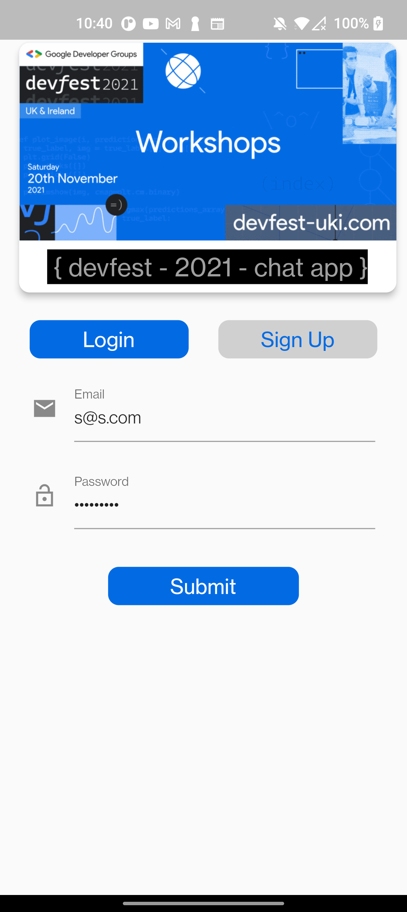

# Introduction

UI for Chat App

credit <https://marcusng.com/>

## Proposed Work

A high-level overview of what we're building and why it will solve the problem.

Food Delivery app. Specially important for this corona times

[/images/chatapp/Screen_Recording_2020-20-10_at_11-33-23.mp4](/images/chatapp/Screen_Recording_2020-20-10_at_11-33-23.mp4)

## vscode Extension

Some Vs code extensions i will be using through out this codelab

<https://www.sumithpd.com/flutter-vscode-extensions/>